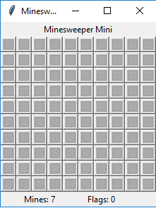

# Python Based Minesweeper mini

_Small game project build with python using tkinter just for fun._

Starting with simple init dunder method importing images and setting up the frame.

```py
class Minesweeper:

    def __init__(self, master):

        # import images
        self.tile_plain = tk.PhotoImage(file = "images/tile_plain.gif")
        self.tile_clicked = tk.PhotoImage(file = "images/tile_clicked.gif")
        self.tile_mine = tk.PhotoImage(file = "images/tile_mine.gif")
        self.tile_flag = tk.PhotoImage(file = "images/tile_flag.gif")
        self.tile_wrong = tk.PhotoImage(file = "images/tile_wrong.gif")
        self.tile_no = []
        for x in range(1, 9):
            self.tile_no.append(tk.PhotoImage(file = "images/tile_"+str(x)+".gif"))

        #Setting Frames
        frame = tk.Frame(master)
        frame.pack()
```

Adding mine and counting

```py
#add mine and count at the end
        self.label2 = tk.Label(frame, text = "Mines: "+str(self.mines))
        self.label2.grid(row = 11, column = 0, columnspan = 5)

        self.label3 = tk.Label(frame, text = "Flags: "+str(self.flags))
        self.label3.grid(row = 11, column = 4, columnspan = 5)
```

**Main Design:**



and some events for game function response

Event one when you lose:

```py
 def gameover(self):
        messagebox.showinfo("Game Over", "You Lose!")
        global root
        root.destroy()
```

**you Lose:**


Event two when you win:

```py
def victory(self):
        messagebox.showinfo("Game Over", "You Win!")
        global root
        root.destroy()
```

**you Win:**


and for flag updation.

```py
def update_flags(self):
        self.label3.config(text = "Flags: "+str(self.flags))
```

**Mines:**


> Project created just for fun stuff feel free to use the code and logics.  
> and Fork me on Github.  
> follow me on social network for latest update.

Facebook: [https://www.facebook.com/whyamiprince](https://www.facebook.com/whyamiprince)

Twitter:  [https://twitter.com/whyamiprince](https://twitter.com/whyamiprince)

Github: [https://github.com/thezero6](https://github.com/thezero6)

instagram: [https://www.instagram.com/whyamiprince/](https://www.instagram.com/whyamiprince/)

